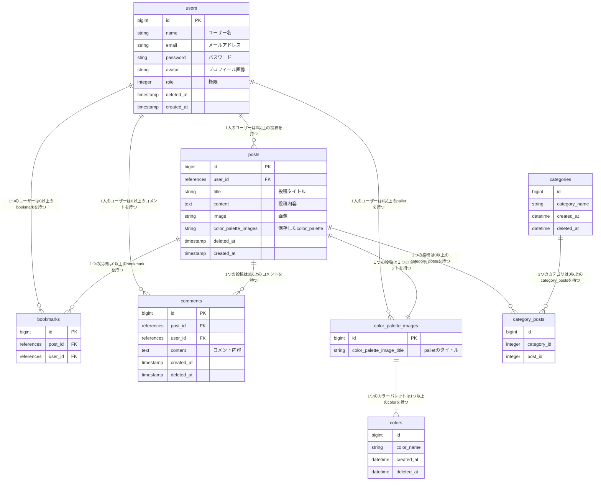

```mermaid
erDiagram
  users ||--o{ posts : "1人のユーザーは0以上の投稿を持つ"
	users ||--o{ bookmarks :"1つのユーザーは0以上のbookmarkを持つ"
  users ||--o{ comments: "1人のユーザーは0以上のコメントを持つ"
	users ||--o{ color_palette_images :"1人のユーザーは0以上のpalletを持つ"
  posts ||--o{ comments: "1つの投稿は0以上のコメントを持つ"
  posts ||--o{ bookmarks: "1つの投稿は0以上のbookmarkを持つ"
	posts ||--|| color_palette_images: "１つの投稿は１つのカラーパレットを持つ"
	posts ||--o{ category_posts: "1つの投稿は0以上のcategory_postsを持つ"
	categories ||--o{ category_posts: "1つのカテゴリは0以上のcategory_postsを持つ"
	color_palette_images ||--|{ colors: "1つのカラーパレットは1つ以上のcolorを持つ"


  users {
    bigint id PK
    string name "ユーザー名"
		string email "メールアドレス"
		sting password "パスワード"
		string avatar "プロフィール画像"
		integer role "権限"
		timestamp deleted_at
    	timestamp created_at

  }

  posts {
    bigint id PK
    references user_id FK
    string title "投稿タイトル"
    text content "投稿内容"
		string image "画像"
		string color_palette_images "保存したcolor_palette"
		timestamp deleted_at
    	timestamp created_at
    
  }
	
   bookmarks {
		bigint id PK
		references post_id FK
		references user_id FK
    }

  comments {
    bigint id PK
    references post_id FK
    references user_id FK
    text content "コメント内容"
    timestamp created_at
	timestamp deleted_at
    
  }

   color_palette_images {
		bigint id PK
		string color_palette_image_title "palletのタイトル"
	}

   categories{
	 bigint id
	 string category_name
	 datetime created_at
	 datetime deleted_at
   }

   category_posts{
		bigint id
		integer category_id
		integer post_id
    }
	
   colors{
		bigint id
		string color_name
		datetime created_at
		datetime deleted_at
	}
```