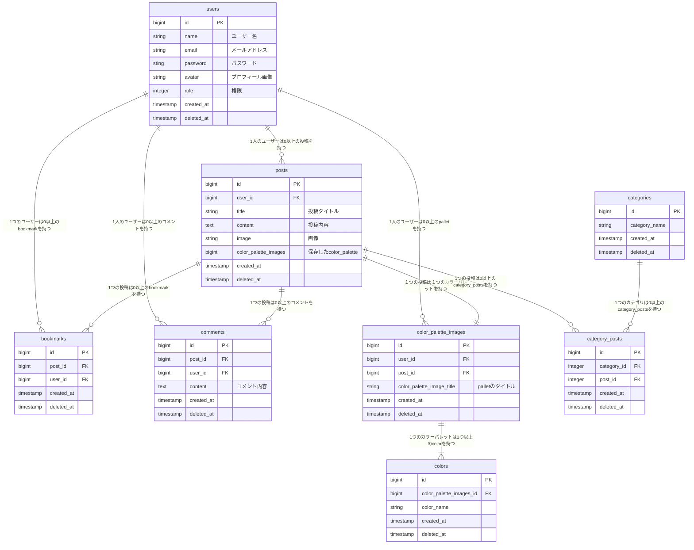

```mermaid
erDiagram
  users ||--o{ posts : "1人のユーザーは0以上の投稿を持つ"
	users ||--o{ bookmarks :"1つのユーザーは0以上のbookmarkを持つ"
  users ||--o{ comments: "1人のユーザーは0以上のコメントを持つ"
	users ||--o{ color_palette_images :"1人のユーザーは0以上のpalletを持つ"
  posts ||--o{ comments: "1つの投稿は0以上のコメントを持つ"
  posts ||--o{ bookmarks: "1つの投稿は0以上のbookmarkを持つ"
	posts ||--|| color_palette_images: "１つの投稿は１つのカラーパレットを持つ"
	posts ||--o{ category_posts: "1つの投稿は0以上のcategory_postsを持つ"
	categories ||--o{ category_posts: "1つのカテゴリは0以上のcategory_postsを持つ"
	color_palette_images ||--|{ colors: "1つのカラーパレットは1つ以上のcolorを持つ"


  users {
    bigint id PK
    string name "ユーザー名"
		string email "メールアドレス"
		sting password "パスワード"
		string avatar "プロフィール画像"
		integer role "権限"
		timestamp created_at
		timestamp deleted_at
    	

  }

  posts {
    bigint id PK
    bigint user_id FK
    string title "投稿タイトル"
    text content "投稿内容"
	string image "画像"
	bigint color_palette_images "保存したcolor_palette"
	timestamp created_at
	timestamp deleted_at
    	
    
  }
	
   bookmarks {
		bigint id PK
		bigint post_id FK
		bigint user_id FK
		timestamp created_at
		timestamp deleted_at
		
    }

  comments {
    bigint id PK
    bigint post_id FK
    bigint user_id FK
    text content "コメント内容"
    timestamp created_at
	timestamp deleted_at
    
  }

   color_palette_images {
		bigint id PK
		bigint user_id FK
		bigint post_id FK
		string color_palette_image_title "palletのタイトル"
		timestamp created_at
		timestamp deleted_at
		
	}

   categories{
	 bigint id PK
	 string category_name
	 timestamp created_at
	 timestamp deleted_at
   }

   category_posts{
		bigint id PK
		integer category_id FK
		integer post_id FK
		timestamp created_at
		timestamp deleted_at
    }
	
   colors{
		bigint id PK
		bigint color_palette_images_id FK
		string color_name
		timestamp created_at
		timestamp deleted_at
	}
	
```